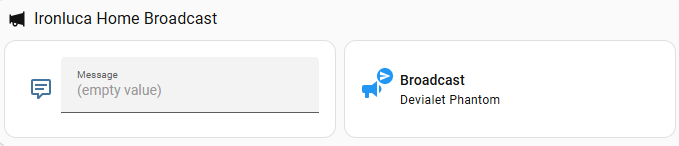
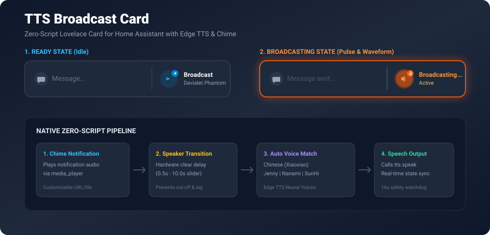
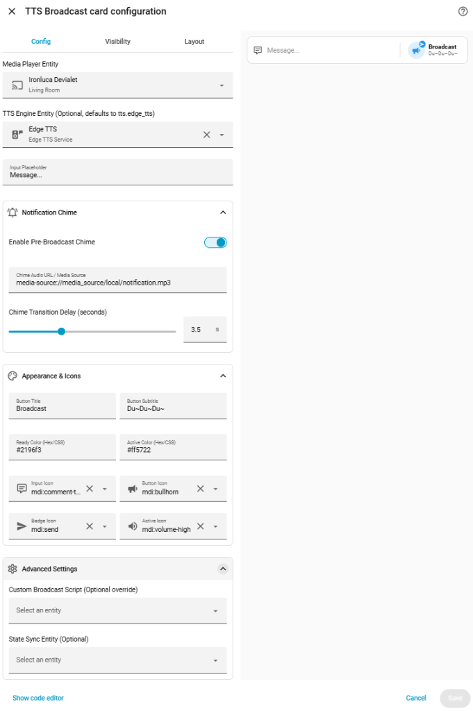

# TTS Broadcast Card (智能语音播报卡片)

<p align="center">
  <a href="https://github.com/hacs/default"></a>
  <a href="https://github.com/lucayunxiao/tts-broadcast-card/releases"></a>
  <a href="LICENSE"></a>
  
</p>

<p align="center">
  <b>Home Assistant Lovelace 现代极简、开箱即用的前端原生 TTS 广播卡片</b><br/>
  集成前置提示音过渡、微软 Edge TTS 多语种神经网络声线自适应、图形化 UI 表单配置与实时动态状态反馈。
</p>

<p align="center">
  <a href="README.md"><b>English</b></a> | <a href="README_zh.md"><b>简体中文</b></a>
</p>

---

## 📸 效果展示 (Preview)



<p align="center">
  
</p>

---

## ✨ 核心特性 (Features)

- ⚡ **零脚本即插即用（Zero-Script）**：100% 由卡片前端组件直接驱动 Home Assistant 核心服务，告别编写后台 YAML Script、自动化与复杂 Jinja 模板！
- 🔔 **前置提示音（Notification Chime）**：支持在语音朗读前播放提示音或电台钟声，提供硬件缓冲延时滑动条（`chime_delay`），有效防止 DLNA、Chromecast、Sonos、HomePod 音箱在切换音频会话时吞字断音。
- 🌐 **微软 Edge TTS 多语言智能声线嗅探**：根据输入文本自动匹配高拟真度神经网络声线，无须人工指定：
  - 🇨🇳 中文 $\to$ `zh-CN-XiaoxiaoNeural`（晓晓）
  - 🇺🇸 英文 $\to$ `en-US-JennyNeural`（Jenny）
  - 🇯🇵 日文 $\to$ `ja-JP-NanamiNeural`（七海）
  - 🇰🇷 韩文 $\to$ `ko-KR-SunHiNeural`（善喜）
- 🎛️ **全图形化配置面板（GUI Visual Editor）**：利用原生 `<ha-form>` 构建折叠面板（基础配置、提示音配置、外观与图标、高级设置），无需手写 YAML。
- 🛡️ **实时状态指示与 16 秒安全熔断**：播报期间呈现呼吸光晕与声波徽标动画，自动监听播放器状态；内置 16 秒超时看门狗，防止因外部音箱状态异常导致按钮死锁。
- 🔄 **完备向下兼容**：保留对传统自定义脚本（Script Mode）与 `input_text` 文本同步接口的向下兼容支持。

---

## 📦 前置依赖建议 (Prerequisites)

### 🎙️ 微软 Edge TTS 自定义集成 (强烈推荐)

本卡片全面兼容 Home Assistant 的所有标准 TTS 实体（包括 `tts.piper`、`tts.google_translate`、`tts.cloud` 等），但**默认针对微软 Edge TTS 进行了专属深度优化**。

建议通过 HACS 安装知名的 [hass-edge-tts](https://github.com/hasscc/hass-edge-tts) 集成，即可在**无需付费订阅**的情况下，畅享微软云端高达 400+ 种媲美真人电台播音员质感的自然声线：

1. 进入 Home Assistant 的 **HACS** 商店。
2. 搜索 **Edge TTS** 并点击下载。
3. 重启 Home Assistant，在 **设置 > 设备与服务 > 添加集成** 中搜索并添加 **Edge TTS**。

> [!NOTE]
> 如果您希望使用 Piper 等本地离线引擎，只需在卡片图形界面的 **TTS 引擎实体** 下拉列表中选择对应的实体（如 `tts.piper`），卡片会自动优雅降级为通用 speak 协议。

---

## 🚀 安装指南 (Installation)

### 方式一：通过 HACS 自定义仓库添加 (推荐)

1. 打开 Home Assistant 左侧栏的 **HACS**。
2. 点击右上角的三点菜单 `⋮`，选择 **自定义存储库 (Custom repositories)**。
3. 在弹出的窗口中填入：
   - **存储库地址**：`https://github.com/lucayunxiao/tts-broadcast-card`
   - **类别**：`Lovelace` (或 `Dashboard` / `Plugin`)
4. 点击 **添加 (Add)**。
5. 在 HACS 卡片列表中搜索 `TTS Broadcast Card`，点击 **下载 (Download)** 并刷新浏览器。

[](https://my.home-assistant.io/redirect/hacs_repository/?owner=lucayunxiao&repository=tts-broadcast-card&category=plugin)

### 方式二：手动安装

1. 下载仓库最新发布的 [`dist/tts-broadcast-card.js`](https://raw.githubusercontent.com/lucayunxiao/tts-broadcast-card/main/dist/tts-broadcast-card.js)。
2. 将文件上传至 Home Assistant 的 `<config>/www/` 目录中。
3. 进入 **设置 > 仪表盘 > 右上角三点 > 资源**。
4. 点击 **添加资源**，URL 输入 `/local/tts-broadcast-card.js?v=1.0.0`，资源类型选择 `JavaScript 模块 (JavaScript Module)`。
5. 保存并硬刷新浏览器缓存（Ctrl+F5 或 Shift+刷新）。

---

## 🛠️ 卡片配置 (Configuration)

### 图形化配置面板 (Visual Editor)

<p align="center">
  
</p>

在仪表盘点击“添加卡片”，搜索并选择 **TTS Broadcast Card**，面板分为四个折叠层级：

1. **基础配置 (Core Settings)**：
   - `media_player`（必填）：目标广播音箱播放器。
   - `tts_entity`（可选）：TTS 引擎实体，默认自动推荐 `tts.edge_tts`。
   - `placeholder`（可选）：输入框提示文字（默认 `Message...`）。
2. **提示音配置 (Notification Chime)**：
   - `chime_enabled`：提示音总开关（Toggle）。
   - `chime_url`：提示音音频链接（支持 `media-source://...`、`/local/...` 或外部 HTTP 音频）。
   - `chime_delay`：提示音与播报之间的缓冲时长（滑动条，0.5秒 ~ 10秒）。
3. **外观与图标 (Appearance & Icons)**：
   - `title` 与 `subtitle`：按钮主副标题。
   - `ready_color` 与 `active_color`：就绪态与播报态主题色（支持十六进制色号与 CSS 变量）。
   - `input_icon`、`button_icon`、`badge_icon`、`active_icon`：自定义 MDI 图标。
4. **高级设置 (Advanced Settings)**：
   - `script`：自定义后台广播脚本实体（覆盖原生流程）。
   - `input_text`：用于同步播报文本状态的文本实体。

---

### YAML 配置示例

```yaml
type: custom:tts-broadcast-card
media_player: media_player.living_room_speaker
tts_entity: tts.edge_tts
placeholder: "请输入广播内容..."
chime_enabled: true
chime_url: media-source://media_source/local/notification.mp3
chime_delay: 3.5
title: "广播"
subtitle: "客厅音箱"
ready_color: "#2196f3"
active_color: "#ff5722"
input_icon: mdi:comment-text-outline
button_icon: mdi:bullhorn
badge_icon: mdi:send
active_icon: mdi:volume-high
```

---

## 📋 配置参数详解 (Options Reference)

| 参数名 | 类型 | 默认值 | 详细说明 |
| :--- | :--- | :--- | :--- |
| `media_player` | string | **必填** | 目标音箱播放器实体 ID (`media_player.xxx`)。 |
| `tts_entity` | string | `tts.edge_tts` | TTS 引擎实体 ID。 |
| `placeholder` | string | `Message...` | 输入框空值提示占位符。 |
| `chime_enabled` | boolean | `true` | 是否在播报前播放提示音。 |
| `chime_url` | string | `media-source://...` | 提示声音频文件路径或网络直链。 |
| `chime_delay` | number | `3.5` | 提示音播放完毕后等待音箱清空缓冲的时长（秒）。 |
| `title` | string | `Broadcast` | 按钮主标题文字。 |
| `subtitle` | string | 播放器名称 | 按钮副标题文字（留空默认显示音箱友好名称）。 |
| `ready_color` | string | `#2196f3` | 就绪（空闲）态主题色。 |
| `active_color` | string | `#ff5722` | 正在播报时的脉冲与高亮主题色。 |
| `input_icon` | string | `mdi:comment-text-outline` | 文本框左侧图标。 |
| `button_icon` | string | `mdi:bullhorn` | 按钮空闲状态图标。 |
| `badge_icon` | string | `mdi:send` | 按钮右上角就绪角标图标。 |
| `active_icon` | string | `mdi:volume-high` | 播报中的声波主图标。 |
| `script` | string | *无* | 高级模式：自定义后台脚本实体（保留向后兼容）。 |
| `input_text` | string | *无* | 高级模式：同步消息文本的 helper 实体。 |

---

## ❓ 常见问题与排错 (FAQ)

<details>
<summary><b>1. 为什么某些无线音箱偶尔会吞掉播报的第一句话？</b></summary>
DLNA、AirPlay 或 Chromecast 音箱从空闲启动到音频会话激活存在硬件唤醒延迟，若启用了前置提示音，不同音箱在切换音频轨时也需要缓冲区复位时间。建议在卡片设置中适当增大 <code>chime_delay</code>（例如调整至 3.5s ~ 4.5s），即可确保声音从容完整播放。
</details>

<details>
<summary><b>2. 如何使用本地的提示音音频？</b></summary>
将 mp3 音频上传至 Home Assistant 的 <b>媒体 > 本地媒体</b>，或放置在 <code>/config/www/notification.mp3</code>，在卡片配置的 <code>chime_url</code> 中填写 <code>media-source://media_source/local/notification.mp3</code> 或 <code>/local/notification.mp3</code> 即可。
</details>

<details>
<summary><b>3. 支持回车快捷发送吗？</b></summary>
支持！在电脑端输入文本后按下 <kbd>Enter</kbd> 键，或在手机虚拟键盘上按下 <kbd>发送</kbd> 按钮，均会自动触发广播并清空输入框。
</details>

---

## 📄 开源许可证 (License)

本项目采用 [MIT 许可证](LICENSE) 开源。欢迎提交 Issue 或 Pull Request！
